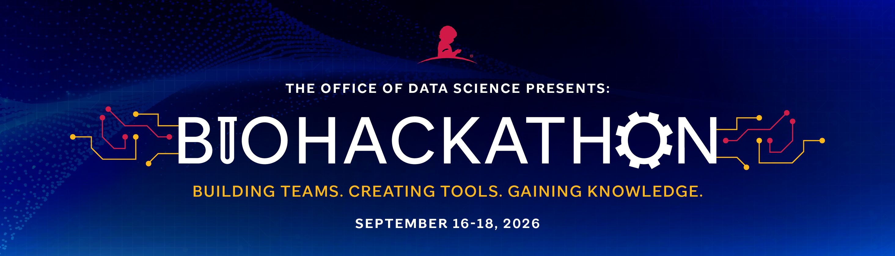

The St. Jude BioHackathon is an annual event where diverse, multidisciplinary participants gather, collaborate, and build data science and AI solutions to address real-world needs during a fast-paced, three-day coding marathon.

Hackathons foster new collaborations among community researchers, encourage the sharing of knowledge and ideas, and provide an ideal environment for learning new skills and testing risky ideas.

In 2026, the St. Jude BioHackathon will be held **September 16–18** at St. Jude Children's Research Hospital.

Visit [the official webpage](https://www.stjude.org/research/why-st-jude/biohackathon.html) to learn more about the event, challenges, and highlights from previous years.

## 2026 Organizing Committees

This year's BioHackathon is made possible through the efforts of 30+ volunteers across several committees - read more about them [here](./bh2026-committee.md):

* Event Operations Subcommittee
* Participant Onboarding Subcommittee
* Projects Review and Team Assignment Subcommittee
* Project Evaluation and Judging Subcommittee
* Technical Support Subcommittee

## Highlights from Previous Years

Originally launched as a volunteer-driven initiative by event chairs **Drs. Jared Andrews and Susanna M. Downing**, with support from Associate Member **Dr. Gang Wu**, the event has since grown into a fully institutionally supported program. The BioHackathon was initially funded by Faculty Affairs; beginning this year, it receives administrative support from the newly established Office of Data Science, which will also provide strategic oversight going forward.

- **2022 — The inaugural BioHackathon** was held internally, with 42 participants across 9 teams competing for the coveted **Golden Floppy Disk**. The winning team, led by Austin Faught and Jared Becksfort, brought together members from the Department of Radiation Oncology and Information Services to model St. Jude's proton beam therapy and help calculate valid treatment trajectories.
- **2023–2024 — Held in association with the Knowledge in Data Science (KIDS) Symposium**, the event expanded dramatically: 80+ participants from 20+ institutions, 5+ companies, and every continent formed 15 teams to build projects spanning image analysis, multiomics integration, and large language models.
- **2025 — The fourth St. Jude BioHackathon** brought together 160 participants from departments across St. Jude and 50+ external institutions *(detailed statistics to be updated)*. Participants collaborated on 21 projects ranging from bioinformatics pipeline development and imaging optimization to the application of AI/LLMs for clinical and administrative data.
  - GitHub repository contributions during the 2025 event, visualized by Jared Andrews: [watch the video](https://i.imgur.com/9QLKvs2.mp4)

Each year features an enjoyable dose of healthy competition, with teams vying for the coveted **Golden Floppy Cube** and **Golden Floppy Disk** awards, including:
  - Most Technically Impressive
  - Most Innovative
  - Best Overall

This year we have a few new surprises for our participants. See you at the BioHackathon.
